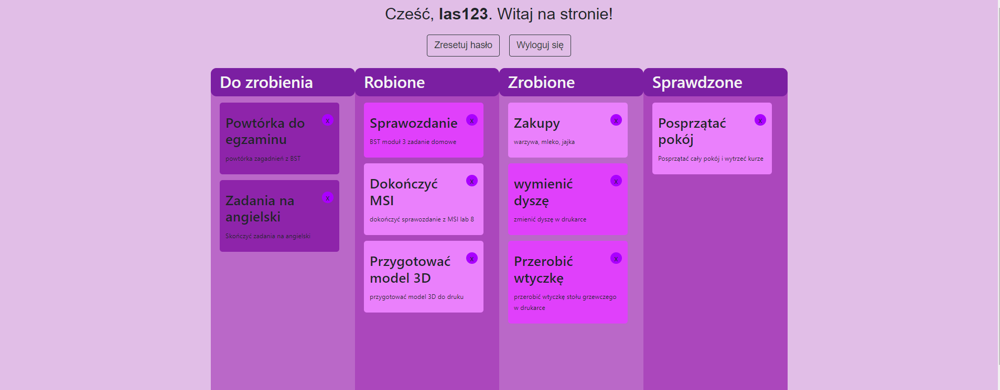
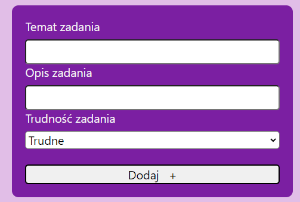

# kanban-systemy-sieciowe
# Kanban
> A simple website with a kanban board.

## Table of Contents
* [General Info](#general-information)
* [Technologies Used](#technologies-used)
* [Features](#features)
* [Screenshots](#screenshots)

## General Information
Project is a simple website with a kanban board to manage your tasks. The project is devoted to mastering the practical skills of application design and implementation client-server network based on the WWW platform.

## Technologies Used
- PHP
- HTML
- CSS
- JavaScript

## Features
List the ready features here:
- add task
- delete task
- drag and drop task

## Screenshots

